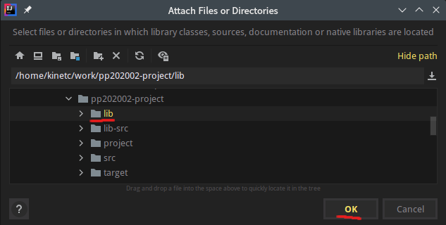

# Project: Programming Principles, SNU 4190.210

Refer to the [manual](pp_proj.pdf), make complete three scripts below.
* [ExprInterpreter](src/main/scala/pp202002/project/impl/ExprInterpreter.scala)
* [MapEnvImpl](src/main/scala/pp202002/project/impl/MapEnvImpl.scala) 
* [Prime](src/main/scala/pp202002/project/impl/Prime.scala)

The basic parser and traits (typeclasses) are fixed and pre-compiled in JAR files.

You can see the structure of `pp202002.project.common` from [lib-src](lib-src), but cannot modify it directly. 

If you cannot import `pp202002.project.common` from IntelliJ IDEA, please see [Troubleshooting](#troubleshooting)

## IMPORTANT: Submissions

You should zip **`impl`** directory from `src/main/scala/pp202002/project` and submit it. That means, you have to submit only three scripts.

The structure of the zip file must look like this.

```
impl
  - ExprInterpreter.scala
  - MapEnvImpl.scala
  - Prime.scala
```

Submission page will be opened next week. 

## How to run and test

This project uses [SBT](https://www.scala-sbt.org/) to build and test Scala codes. 

IntelliJ IDEA has a builtin support for SBT, so you should just open this directory from IntelliJ.

If you want to run this project manually, please install SBT manually and run below.
 
```bash
# compile scripts
sbt compile

# run 'src/main/scala/pp202002/project/Main.scala`
sbt run

# run test suites by scalatest
# you can find some tests from 'src/test/scala' 
sbt test
```

If you have any troubles related with SBT or execution, please submit an issue to [issue tracker](https://github.com/snu-sf-class/pp202002/issues).

## Restrictions

* Do not use keyword `var` (except in `EVLazyVal`). Use `val` and `def` instead.
  * To implement laziness, you should exploit `var evaluated` from `EVLazyVal`  
* You can use some scala methods and APIs that we used from skeletons. Precisely, you can now use APIs and data structures from below. 
  * `scala.collection.*` (except `scala.collection.mutable.*`)
  * `scala.util.*`
  * `scala.{Option, None, Some, Either, Left, Right, List, Nil, ::, Seq, Iterable}`
  * methods of primitive types (i.e. `String`, `Char`, `Int`, ...) 

## Q&A

If you have any questions, please submit an issue to [pp202002 issue tracker](https://github.com/snu-sf-class/pp202002/issues).


## Troubleshooting

IntelliJ IDEA does not recognize JARs in `lib` directory by default. (but SBT can, so your project will be compiled by SBT without any problems)
 
If `import pp202002.project.common._` is not resolved from IDE, go to `File > Project Structure` and follow the instructions below.

* `Project Settings > Modules > pp202002-project > Dependencies > press + > JARS or directories...`


* Find `pp202002-project/lib` and press `OK`



